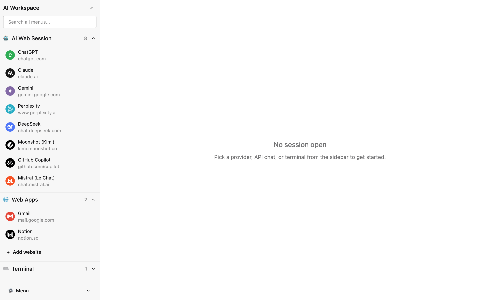
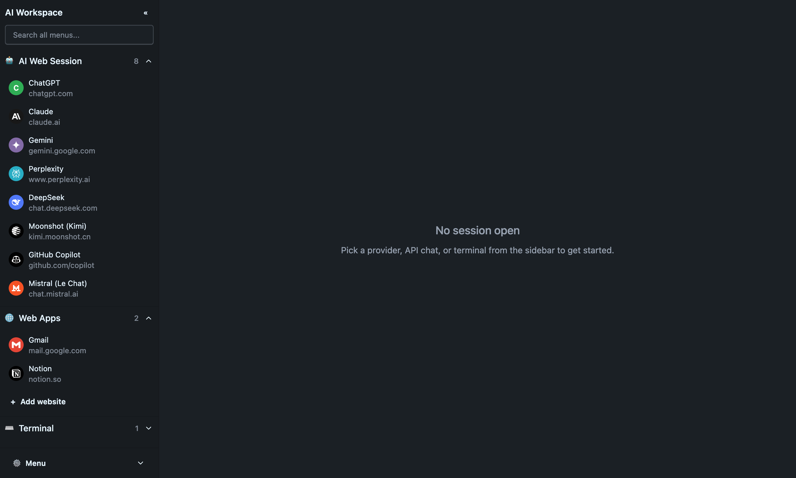
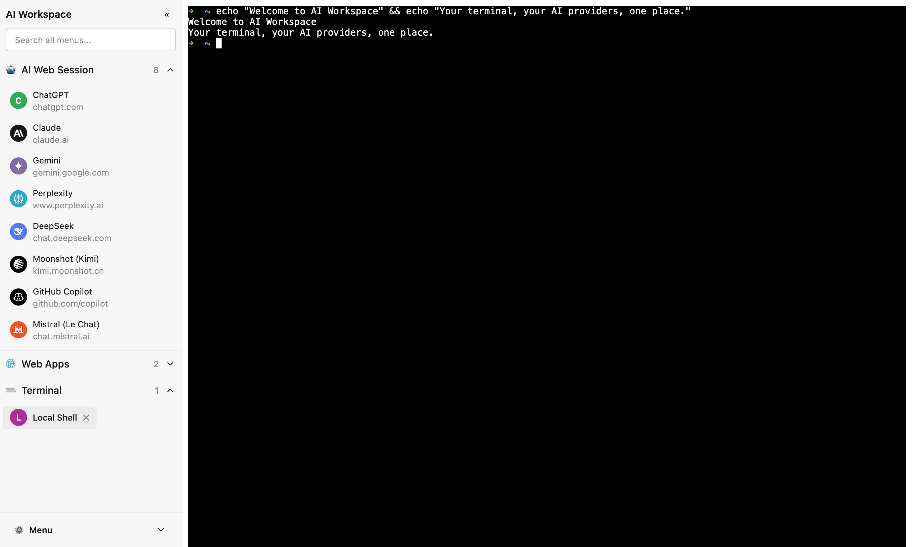
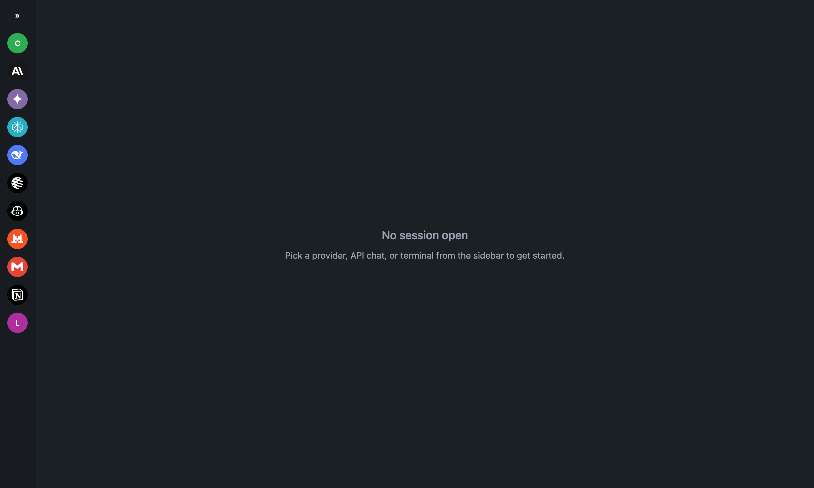

# AI Workspace

**Every AI provider you use, one desktop app.** ChatGPT, Claude, Gemini, DeepSeek, and more — each logged in, isolated, and remembered, alongside your web apps and a real terminal. No more juggling a dozen browser tabs.

[Download the latest release](https://github.com/mkeology/desktop-ai/releases/latest) · Windows, macOS, and Linux

## Why

Every AI provider, one place, no compromise on isolation:

- **One app, every provider** — ChatGPT, Claude, Gemini, Perplexity, DeepSeek, Moonshot, GitHub Copilot, Mistral, and your own web apps, all in one sidebar.
- **Real accounts, real isolation** — each account gets its own persistent, cookie-isolated session, just like separate browser profiles, without the browser.
- **A real terminal, right alongside them** — a genuine local shell (not a toy), open next to your AI sessions.
- **Light or dark**, your call, remembered.
- **Free and open source.**

## See it in action

<table>
<tr>
<td width="50%"></td>
<td width="50%"></td>
</tr>
<tr>
<td width="50%"></td>
<td width="50%"></td>
</tr>
</table>

## Install

Grab the installer for your OS from the [latest release](https://github.com/mkeology/desktop-ai/releases/latest):

| Platform | What you download |
|---|---|
| **Windows** | `.exe` — double-click, click through the installer |
| **macOS** | `.dmg` — drag into Applications |
| **Linux** | `.AppImage` (make it executable and run) or `.deb` |

No account or setup wizard — download, install, open. The app checks for updates automatically after that.

Want to see what's new or what's coming? See the [Features & Changelog](docs/specs/02-features-and-changelog.md).

## Contributing

Pull requests, issues, and feature requests are more than welcome. See the [Developer Guide](docs/developers.md) to get a local build running, plus the checks CI expects from a PR — and [`docs/specs/`](docs/specs/README.md) for the product's design and roadmap.

## License

See [LICENSE](LICENSE).
