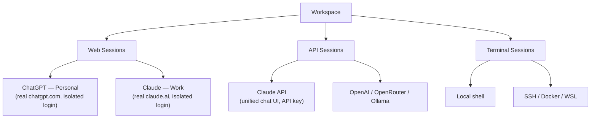
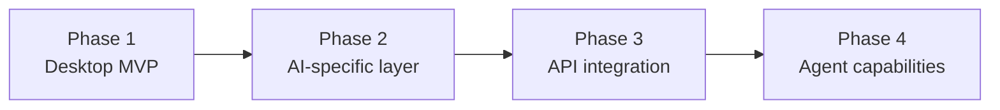

# Product Vision

**Audience:** Business Owner / Product Owner (BO). Useful background for everyone else too.

## One-liner

**AI Workspace** — a desktop app where every AI provider, API, and terminal you use lives in its own isolated, persistent session, organized into switchable workspaces.

## The problem

- **Unified API chat tools** are API-first: great unified chat UI, but they don't give you the actual ChatGPT/Claude/Gemini *website* — no web-only features, no using an existing subscription you already pay for.
- **Multi-account isolated-session browsers** solve multi-account, isolated web sessions well, but have no AI-specific focus: no provider catalog, no concept of "an AI workspace."
- People doing serious AI-assisted work end up with a dozen browser tabs, juggling multiple logged-in accounts per provider (personal vs. work), plus a separate terminal, plus separate API playgrounds — none of it organized or restorable as a set.

## The product concept

Three kinds of **Session**, held inside a **Workspace**:

- **Web sessions** — the real provider website, logged in with the user's real account, isolated per-account so "ChatGPT Personal" and "ChatGPT Work" never share cookies.
- **API sessions** — a unified chat interface driven by API keys (OpenAI, Anthropic, Gemini, OpenRouter, local models via Ollama/LM Studio).
- **Terminal sessions** — a real local/SSH/Docker terminal, first-class alongside the other two, because AI-assisted work is inseparable from running commands.
- **Workspaces** are saved layouts of sessions (e.g. "Development": Claude + GitHub + Terminal in a split view) that restore in one click — not just another tabbed browser.

Every provider is data, not code — adding a new AI provider or an arbitrary web app (Gmail, Notion, Slack, ...) is adding a catalog entry, not a feature.

## Differentiation

| | Unified API chat tools | Multi-account isolated-session browsers | AI Workspace |
|---|---|---|---|
| Real provider website + your existing subscription | ✗ | ✓ (generic) | ✓ |
| Multiple isolated accounts per site | ✗ | ✓ | ✓ |
| Unified API chat | ✓ | ✗ | ✓ |
| Built-in terminal as a first-class session | ✗ | ✗ | ✓ |
| AI-specific provider catalog & workspaces | ✗ | ✗ | ✓ |

## Roadmap

- **Phase 1 — Desktop MVP:** shell, sidebar, tabs, add-website, persistent login, isolated per-account profiles, split-screen.
- **Phase 2 — AI-specific layer:** curated provider catalog with logos/categories, favorites, quick launch, saved workspace presets.
- **Phase 3 — API integration:** unified API chat sessions alongside web-login sessions, so every provider can offer "Web Login" and "API" side by side.
- **Phase 4 — Agent capabilities (future, not committed):** controlled, explicitly-permissioned access from an API session to a terminal session (e.g. "run this test and show me the result"), plus files/notebooks/MCP tools — built on the same Session abstraction, never as a default-on capability.

## Non-goals

- Not a general-purpose web browser — no ambition to replace Chrome/Edge for everyday browsing.
- Not a pure PWA — the isolated-account requirement rules that out (see [Architecture](./04-architecture.md)). A reduced-functionality web companion may exist later, out of scope for now.
- Not modifying or scraping provider UIs — see [Agent Rules](./00-agent-rules.md).

## Open questions (not yet decided — ask before assuming)

- Pricing/licensing model (free, one-time, subscription).
- Whether/when a companion landing-page web app also hosts account/billing, vs. being pure marketing.
- Exact initial provider catalog and default workspace presets.
