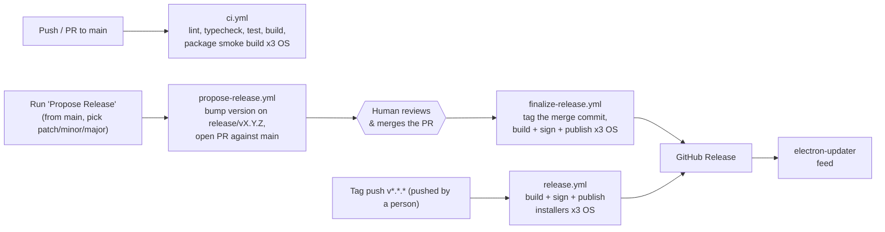

# DevOps & Release

**Audience:** DevOps. Reflects the actual workflows in [`.github/workflows/`](../../.github/workflows/) — keep this page and those files in sync.

## Pipeline overview

Cutting a release is two steps, not one, because this repo requires every change to `main` to go through a reviewed pull request — a workflow can't just push a version-bump commit directly:

- **`propose-release.yml`** — trigger it manually (Actions tab → "Propose Release" → Run workflow, from `main`, choosing a patch/minor/major bump). It bumps `apps/desktop/package.json` on a new `release/vX.Y.Z` branch and opens a PR against `main`.
- **A human reviews and merges that PR** — same as any other change to `main`.
- **`finalize-release.yml`** — runs automatically when a `release/*` PR merges into `main`: tags the merge commit and builds + publishes installers for all three OSes. This is unaffected by the "PR required" rule because that rule targets the `main` branch ref, not tag refs — a workflow pushing a *tag* is fine; pushing directly to the `main` *branch* is what's blocked.
- **`ci.yml`** — every push/PR to `main`: lint, typecheck, unit tests, build, and an electron-builder `--dir` smoke package on Ubuntu, macOS, and Windows. Must stay green; it's the gate before any PR (including a release-bump PR) can merge.
- **`release.yml`** — a fallback: if a person pushes a `v*.*.*` tag themselves (with their own git credentials) instead of going through `propose-release.yml`, this builds and publishes for all three OSes the same way `finalize-release.yml` does.
- The landing page (`apps/web`) has **no packaging/signing step** — it deploys as a normal site once a hosting target is chosen (not decided yet, see [Product Vision](./01-product-vision.md)).
- Every workflow declares an explicit, least-privilege `permissions:` block for its `GITHUB_TOKEN` rather than relying on the repository default — see [GitHub's guide](https://docs.github.com/en/actions/tutorials/authenticate-with-github_token). `ci.yml` needs only `contents: read`; `release.yml` and `finalize-release.yml` need `contents: write` (pushing tags, creating releases); `propose-release.yml` additionally needs `pull-requests: write` to open its PR.

## Versioning

- SemVer (`MAJOR.MINOR.PATCH`), bumped in `apps/desktop/package.json` — normally via **Propose Release** (`propose-release.yml`) rather than by hand.
- A release is a git tag `vX.Y.Z` on `main`.
- Every release gets an entry in [Features & Changelog](./02-features-and-changelog.md) before or in the same change as the tag.

## Installation must be really easy — packaging requirements

| Platform | Format | Requirement |
|---|---|---|
| Windows | NSIS installer (`.exe`) | Per-user install by default (no admin prompt required); one-click through |
| macOS | `.dmg` | Signed **and notarized** — no Gatekeeper "unidentified developer" warning; drag-to-Applications |
| Linux | `.AppImage` + `.deb` (and `.rpm` if demand appears) | AppImage needs no install step at all; deb/rpm for users who prefer a package manager |

No installer should ever prompt for configuration, accounts, or license keys before the app opens.

## Branding

- **App icon** — `apps/desktop/resources/icon.{icns,ico,png}`, referenced explicitly per platform in `electron-builder.yml`, plus used at runtime for the dev-mode window/dock icon (`src/main/index.ts`). Source is a plain SVG (not committed — regenerate from the design if it ever changes) rasterized with `rsvg-convert` and packaged with `iconutil` (macOS `.icns`) and `png-to-ico` (Windows `.ico`).
- **Provider brand icons** — `apps/desktop/src/renderer/src/data/brandIcons.ts` holds real logo paths + colors from [Simple Icons](https://simpleicons.org) (CC0-1.0 for the artwork; the marks themselves remain trademarks of their respective owners — used here only to identify the service, not to imply endorsement). Not every provider has one: OpenAI/ChatGPT isn't in that dataset (removed at their request) and isn't approximated from memory — it keeps `ProviderIcon`'s colored-initial fallback, which is also what any user-added custom site gets.

## Updates must be really easy — auto-update requirements

- `electron-updater`, feed pointed at GitHub Releases (default; a dedicated update server is a future option if needed).
- Check on app launch and on an interval while running; download new versions in the background.
- Never interrupt the user mid-work — apply on next restart, with a small non-blocking "Update ready" affordance.
- Manual "Check for updates" menu entry as a fallback, never a requirement.
- A bad release must be revertible: keep the ability to unpublish/mark a GitHub Release as pre-release so the updater feed doesn't offer it, and re-tag a patch release promptly.

## Signing & secrets

`release.yml` already expects these as optional GitHub Actions secrets (build stays functional, just unsigned, if absent — but **do not ship an unsigned release to users**):

| Secret | Purpose |
|---|---|
| `CSC_LINK` / `CSC_KEY_PASSWORD` | macOS/Windows code-signing certificate |
| `APPLE_ID` / `APPLE_APP_SPECIFIC_PASSWORD` / `APPLE_TEAM_ID` | macOS notarization |

Certificates and passwords live only in GitHub encrypted secrets — never in the repo, never in workflow logs.

## Environments & channels

- Single `stable` channel for now. A `beta`/pre-release channel is a reasonable future addition once there's a user base to stage rollouts to — not built until asked for.
- No server-side environments to manage yet: the product is a local desktop app with no required backend. If a backend appears later (e.g. for a licensing or sync feature), it gets its own page.

## Monitoring & maintenance

- Keep dependencies patched; treat `npm audit`/Dependabot alerts as real work (see [Security](./06-security.md)).
- Crash reporting / opt-in telemetry: not implemented yet — if added, it must be opt-in and disclosed in [User Guide](./03-user-guide.md)'s privacy section before shipping.
